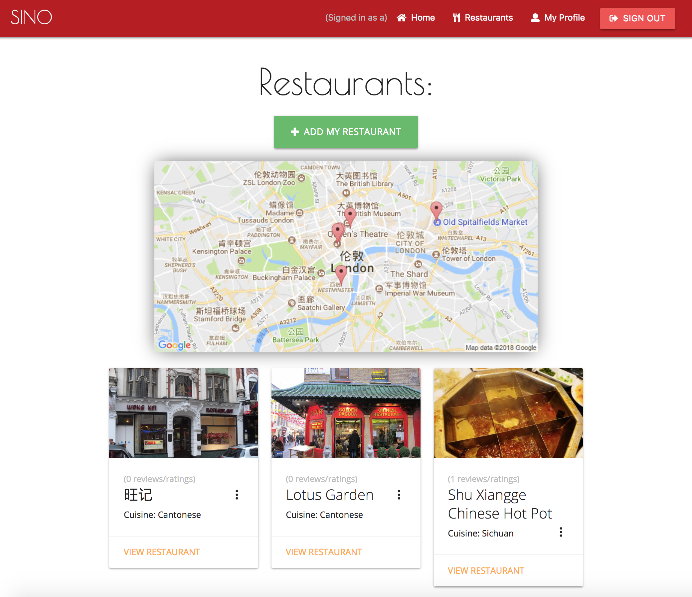
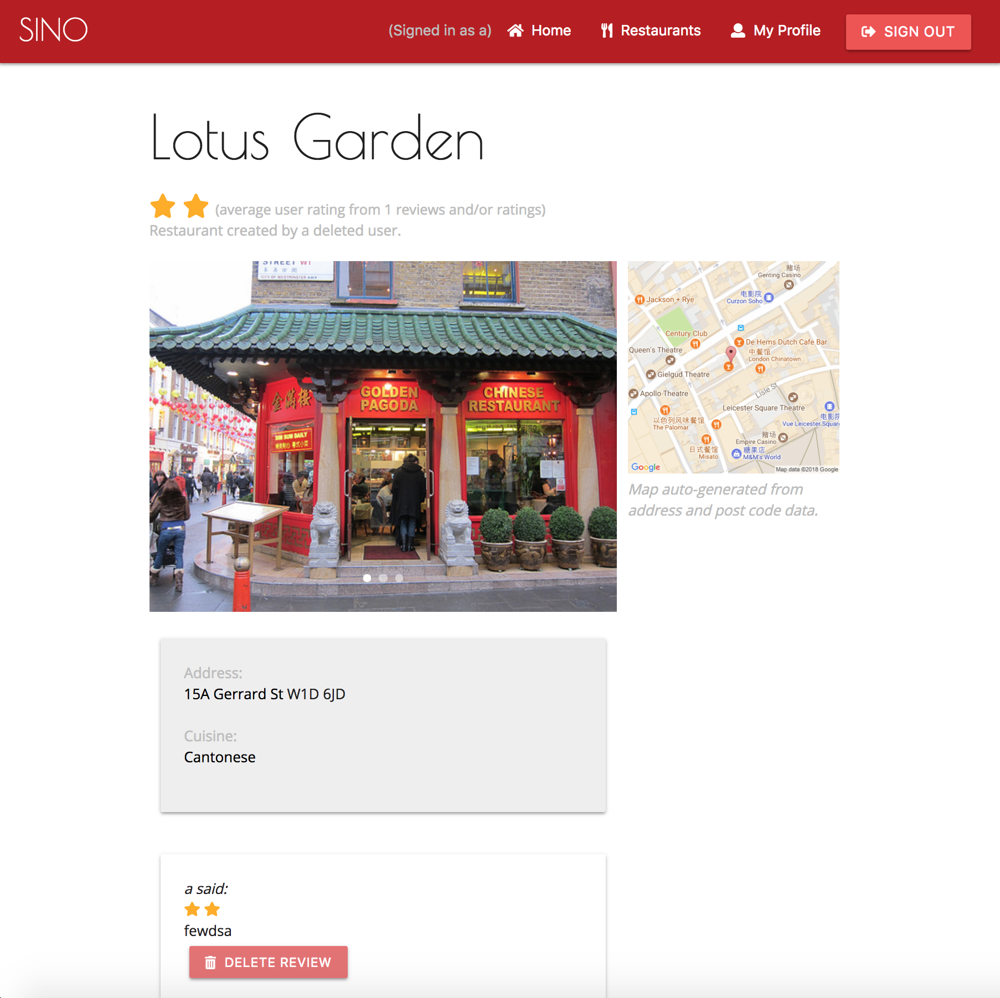
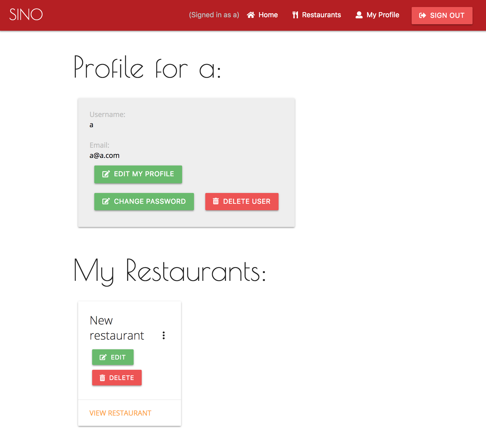

# Sino
---
(5 days individual project)

## Table of Contents

* [Links](#links)
* [Description](#description)
* [Technologies Used](#technologies-used)
* [Screenshots](#screenshots)
<!-- * [Code Examples](#code-examples)
* [Challenges](#challenges)
* [Wins](#wins)
* [The Future](#the-future) -->

## Link

* [Heroku](https://sino-review.herokuapp.com/)

## Description

**This restaurant review app was made as an opportunity to learn to work with a Node.js backend featuring two RESTful resources. The front-end was styled using Materialize and made use of the Google Static Maps API.**

## Technologies Used

- HTML 5
- CSS 3 (with SASS and Materialize)
- Node.js
- JavaScript
- EJS
- Google Fonts
- Google Static Maps API
- Git & GitHub

## Approach Taken

This project was my first attempt at exploring any sort of back-end technology, and to that end the main challenge was to overcome what had become my comfort zone of writing in vanilla JavaScript.

The app featured three resources: users, restaurants and reviews. Users can log in, post a restaurant and post reviews for restaurants that are not your own. Reviews are then used to calculate an average review for each restaurant.

The app makes use of the Google Static Maps API to produce a map of all the restaurants on the site and to give a map of the location of each site, the location being calculated based on the user-input postcode for each restaurant.

## Screenshots

